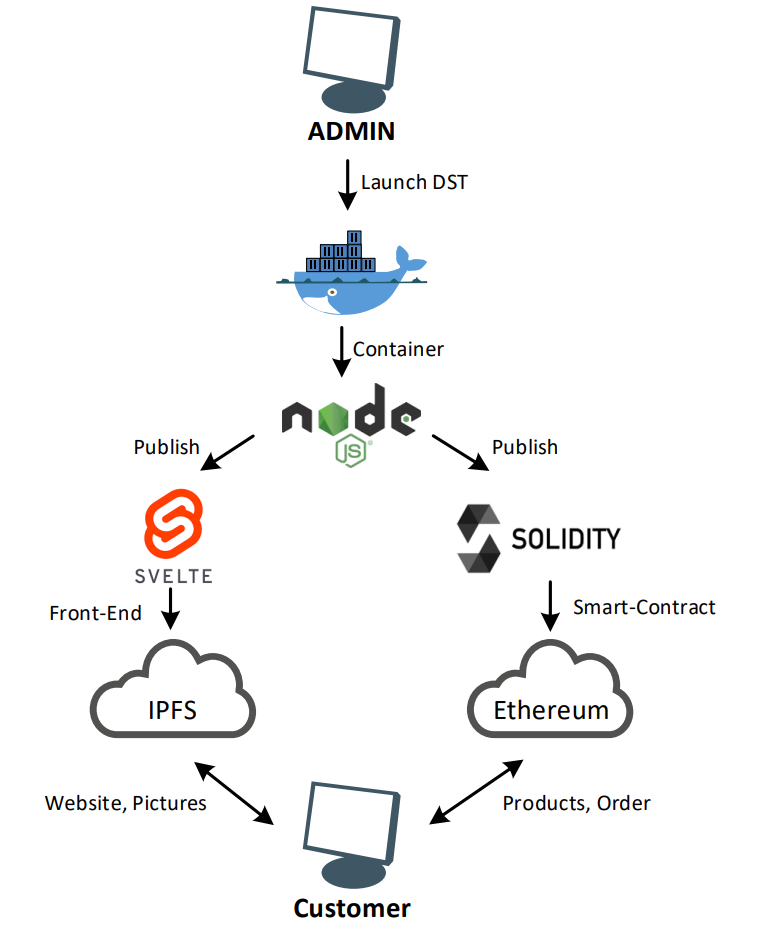

# DST - Decentralized Shop Toolkit


Sie wollten schon immer einen eigenen Shop betreiben doch haben keine Ahnung wie das geht? Dann sind Sie hier genau richtig. Das DST bietet die Möglichkeit einen voll funktionsfähigen Marketplace mit wenigen Klicks zu starten.

## How to use it
### Abhängigkeiten

Um den Source-Code zu kompilieren und das Projekt auszuführen wird [Docker](https://www.docker.com/get-started/) als einzige Abhängigkeit benötigt. Das System muss eine `amd64`-Architektur vorweisen.

### Installation

Folgende Schritte müssen eingeleitet werden um den Shop zu installieren und auszuführen:

1. Zunächst wird das Repository geklont:
   ```bash
   $ git clone https://github.com/MeLThRoX/DST
   ```

2. Als nächstes wird in den neunen Ordner navigiert:
   ```bash
   $ cd DST
   ```

3. Nun muss der Private Schlüssel des Ethereum Wallets innerhalb der `docker-compose.yml` festgelegt werdem. Dazu wird der [Private Schlüssel über Metamask exportiert](https://metamask.zendesk.com/hc/en-us/articles/360015289632-How-to-Export-an-Account-Private-Key) und für die Variable `PRIVATE_KEY` gesetzt:
   ```yml
   dst:
      build:
         context: .
         args:
            - PRIVATE_KEY=<Privater Schlüssel>
   ```
4. Nun muss die Configurationsdatei `config.json` nach belieben angepasst werden:
   ```json
   {
      "shop_name": "MyNewShop",
      "categories": ["Cat1", "Cat2", "Cat3"]
   }
   ```
5. Zuletzt müssen noch mittels `docker-compose` die benötigten Container gestrartet werden. Dazu wird folgender Befehl ausgeführt:
   ```bash
   $ docker-compose up -d
   ```


## Programm-Overview
In folgender Darstellung ist das Verhältnis des Repos zu den Docker-Containern und dem deployted Code zu erkennen:


Die nächste Abbildung zeigt den Ablauf eines Deployments. Die verschiedenen Technologien, die innerhalb des Projektes verwendet werden, interagieren wie folgt:



## Verwendete Technologien

### Solidity

#### Verwendung

**Solidity** wird verwendet, um einen Smart-Contract zu Erstellen. Dieser Contract bietet die Grundlage für jeden Shop, der von einem User erstellt wird. Er bietet die Funktionalität zum Verwalten des Shop-Inventars und der Bestellabwicklung. Die einzelnen Funktionen des Contracts werden über das Svelte-Frontend angesteuert.

Der [Contract](backend/solidity) wird beim initialisieren des Shops automatisch vom Repo aus kompiliert und neu deployed. Dabei wird die Walletadresse des Admins innerhalb der verwendeten Chain hinterlegt. Diese wird für verschiedene Aufgaben benötigt. Auf der einen Seite wird das Aufrufen mancher Funktionen auf den Adminnutzer begrenzt. Der private Wallet-Key des Admins muss zuvor innerhalb einer .env Datei hinterlegt werden.

Beim Deployen des Contracts wird die Wallet-Adresse des Admins innerhalb des Contracts hinterlegt. Anhand dieser wird der Zugriif auf manche Funktionen, wie beispielsweise das Hinterlegen neuer Produkte oder dem Anpassen des Inventars, beschränkt. 

#### Warum Solidity?

Solidity ist **die** Programmiersprache um Smart-Contracts für die Ethereum-Chain und dessen Forks oder Testnets zu erstellen. Da der DST dezentralisiert laufen soll und Kaufprozesse von Produkten ohne die Verwendung einer zentralen Entität abschließen soll, ist die Ethereum-Chain mit Solidity die perfekte grundlage die nötige Logik zu entwickeln.

### Svelte

#### **Svelte**:
Laut neuster [Statistiken von State of JS](https://2021.stateofjs.com/de-DE/libraries/front-end-frameworks) ist [Svelete](https://svelte.dev/) das Interessanteste Front-End-Framework. Zudem passt es gut zu diesem Projekt, da Statischer HTML-/JS-/CSS-Code generiert werden kann, welche schließlich über IPFS gehostet werden kann.

#### **Svelte-Kit**:
Das [Svelte-Kit](https://kit.svelte.dev/) wird genutzt, weil es die möglichkeit bietet mit `routes` eine Multi-Page-Website zu erstellen. Zudem ist es laut State of JS das Interessanteste Back-End-Frameworks 2021. In diesem Projekt wird es jedoch nur genutzt um eine statische Webseite zu builden.

#### **IPFS**:

### Docker

## Testing

## Mögliche Hindernisse

### Gas-Fees
Wie bei vielen Projekten, die sich mit Ethereum befassen, ist eins der größten Probleme, die aktuell beim DST noch besteht, die hohen Gas-Fees für das Ausführen einer Transaktion. Das beeinflusst also nicht nur das Deployen des neuen Contracts im Rahmen der Initialisierung, das Hinzufügen von neuen Produkten, sondern auch den reinen Kaufprozess. Die Gas-Fees müssen immer von der Partei bezahlen, die eine Transaktion auslöst. Beim Kaufen eines Produktes muss der Kunde also die zusätzlichen Kosten tragen.

#### Mögliche Lösung
[**Arbitrum**](https://offchainlabs.com/) könnte eine Lösung für dieses Problem sein. Arbitrum verwendet Roll-Ups um dadurch die Gas-Fees und die Ausführungszeit von Transaktion zu reduzieren. Um diese Technologie auf DST zu übertragen, muss der Contract lediglich auf die Arbitrum-Chain deployed werden. Der Solidity-Code selbst muss dafür nicht angepasst werden.

### IPFS
Das Frontend eines DST-Shops wird unter anderem über IPFS erreichbar sein. In ersten Tests ist jedoch aufgefallen, dass IPFS teilweise sehr lange braucht, um die entsprechenden Komponenten zu laden und dann darzustellen. Das beeinflusst die Benutzerfreundlichkeit negativ. Bisher wurde noch keine konkrete Lösung zu dem Problem gefunden.

#### Erster Workaround
Um dem Admin eines DST-Shops die Möglichkeit zu geben, dass Problem zu umgehen, wird beim Initialisieren des Shops gleichzeitig eine Instanz auf IPFS und einem lokalen Port gestartet. Fall IPFS also zu langsam sein sollte, kann der Admin auf den lokal laufenden Server umsteigen. Dabei geht jedoch die Dezentralität des Shops teilweise verloren.
